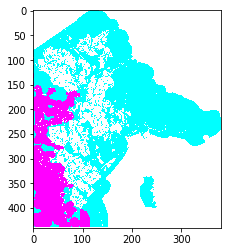

# simulate-bushfire
Reads in forest data pertaining to the incidence of bushfires, wind speed, vegetation type and density in the form of .csv files and runs a stochastic bushfire simulation.

Note: The python file 'simulation' will not work on its own in its current form. Additional function calls need to be added to ensure that relevant map data is being read and processed.

The resultant simulation on a map of a certain geographical area might show the spread of bushfire, such as the one seen in the following image:

